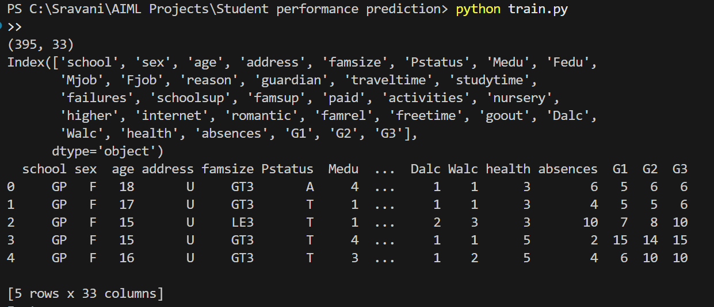
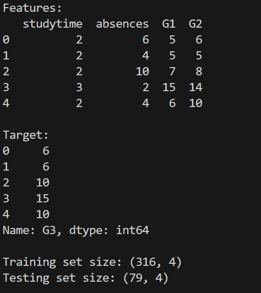
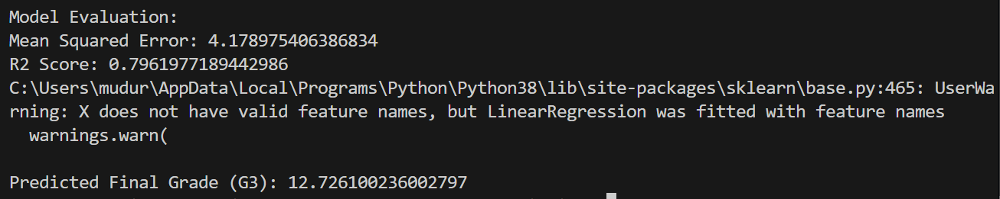

🎓 Student Performance Prediction using Machine Learning
📌 Project Overview
This project focuses on predicting student academic performance based on various factors such as study time, previous grades, and absences using Machine Learning techniques. The goal is to analyze student data and build a regression model that can accurately predict final grades.

🧠 Problem Statement
Educational institutions often struggle to identify students who may need academic support. By analyzing historical student data, this system predicts student performance and helps in early intervention.

⚙️ Technologies Used
Programming Language: Python
Libraries:
NumPy
Pandas
Matplotlib
Scikit-learn
Algorithm: Linear Regression
IDE: VS Code
Platform: GitHub

📂 Dataset
Student performance dataset
Contains 395 records and 33 attributes

Key features used:
Study Time
Absences
First Period Grade (G1)
Second Period Grade (G2)
Target variable:
Final Grade (G3)

🔄 Project Workflow
-Data loading and exploration
-Data preprocessing
-Feature selection
-Train-test split
-Model training
-Model evaluation
-Performance analysis

📊 Model Evaluation
The model was evaluated using standard regression metrics:
Mean Squared Error (MSE): 4.17
R² Score: 0.79
These results indicate that the model performs well in predicting student performance.

## 📸 Project Output Screenshots

### 🔹 Model Training Output

### 🔹 Model Evaluation Metrics

### 🔹 Final Prediction Result

▶️ How to Run the Project
1.Clone the repository:
git clone https://github.com/your-username/student-performance-prediction-ml.git
2.Navigate to the project folder:
cd student-performance-prediction-ml
3.Install dependencies:
pip install -r requirements.txt
4.Run the training script:
python train.py

📈 Future Enhancements
-Use advanced models (Random Forest, XGBoost)
-Add data visualization graphs
-Create a web interface using Flask or Streamlit
-Include more student behavioral features
